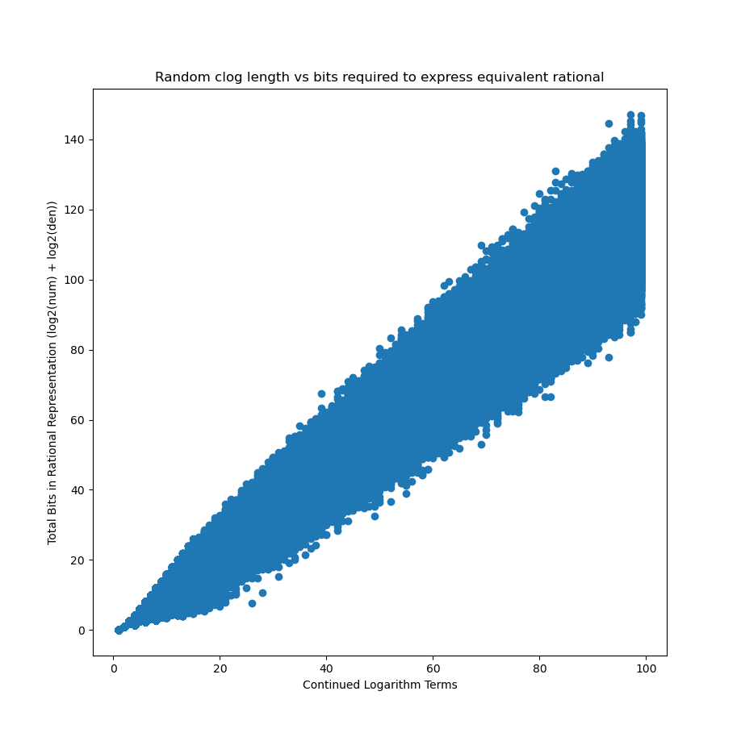

1L Part III: Continued Logarithms Are a Flawed Way to do Rational Arithmetic
=

...but perhaps an underrated way to mix real and rational arithmetic.

Continued logarithms never caught on as a representation for doing computer arithmetic.

(This is something of a pivot from my first two 1L posts; I opted to try something different for my second quarter)

## Wait, What Are Continued Logarithms?

For the uninitiated, continued logarithms are a variant of continued fraction first conceived in [a 1975 manuscript written by Bill Gosper](https://www.tweedledum.com/rwg/cfup.htm).

They enable a far more computationally efficient arithmetic algorithm than is otherwise possible for continued fractions, while preserving many of their nice properties, making them suitable (at least in theory) for exact high precision arithmetic.

The original paper, dense as it is, can probably motivate and explain them better than I can here. It's a delightful read, would recommend :D

To briefly recap, here's what a basic continued logarithm is: a binary string, where a 1 conveys "I was > 2, so halve me", and a 0 conveys "I was between 1 and 2, so subtract 1 and reciprocate me" (and maybe we have a 2 bit preamble for the case that you're less than 1).

Here's the process for finding the continued logarithm of 30/7.

```
30/7      | 1
30/14     | 1
30/28     | 0
28/2 = 14 | 1
7         | 1
7/2       | 1
7/4       | 0
4/3       | 0
3/1       | 1
3/2       | 0
2/1       | 1
1/1       | 0
1/0       | oo

30/7 = 110111001010
```

## Continued Logarithms Are Flawed

Continued logarithms never did catch on; there's very little literature about them, and they are very obscure compared to other methods for high precision arithmetic (arbitrary precision floats, bignum rationals, interval arithmetic).

I got to wondering why, and I've come to the conclusion that it's at least partially due to the fact they use too many bits to represent the numbers people actually want to represent.

But first, their advantages, of which they on their face have many.

Algorithms written for continued logarithms ingest and egest the representation left to right, always dealing with the most significant bits first. You can interrupt a process and get an accurate but truncated output. Operations like arithmetic or sqrt or log can be treated like composable lazy iterators, feeding terms into each other on-demand; they're most naturally framed as a DAG (directed acyclic graph), like that shown below.


Arithmetic uses only bitshifts, swaps, compares, and two's complement addition/subtraction, on the order of one add/sub per output bit, where the order of magnitude of the integers involved scales linearly with the number of terms already inputted. Not especially efficient, but (especially with dedicated hardware) it might compare favorably with rational arithmetic, or other methods that require big integer division.

Also, since this algorithm evaluates expressions of the form `(axy + bx + cy + d)/(exy + fx + gy + h)`, division is no more expensive than addition, and what might otherwise be multiple distinct arithmetic operations can be bundled together.

There exist algorithms for sqrt ([Gosper](https://www.tweedledum.com/rwg/cfup.htm); line 1101 for cfracs, line 2486 for clogs) and log/exp (first attested [here in this random Haskell package](https://mathr.co.uk/web/continued-logarithm.html#Logarithm)), along with all the trig stuff you could possibly want, all approximately as taxing as regular arithmetic.

Continued logarithms, like continued fractions, are capable of representing all exact rationals with a number of bits scaling with the complexity of the number. No `0.1 + 0.2 = 0.30000000000000004`. That's all well and good, but what does "scaling with the complexity of the number" mean, exactly?

In the case of continued fractions, it's very clear: the Stern-Brocot tree enumerates all rationals nonredundantly, and simple continued fractions can be thought of as a run-length encoding of a path down the tree. This is very mathematically pleasing, and the more complex a rational is (the larger its denominator is) the further down the tree it is (and hence the more bits it requires).

However, as Gosper points out in his original paper [[Gosper](https://www.tweedledum.com/rwg/cfup.htm) line 2408], this correspondence renders continued fractions a very inefficient representation. Each term is an integer, but it's not obvious how big an integer to allocate for each term; they do not span orders of magnitude well, as representing 2^128 would require leading with a 128 bit integer. Decomposing continued fractions into binary strings makes this problem much worse; 2^128 would require 2^128 leading 1s. This issue also applies to negative orders of magnitude; 2^-128 is 0 2^-128 leading 0s, or [0; 2^128]. The representation is heavily biased to numbers near 1/1.

Continued logarithms might have a better spread: each 1 term represents a binary order of magnitude, so that 2^128 requires only 128 bits; by the same token, 2^-128 requires just 129.

Unfortunately, the way this representation spreads its precision remains problematic. I haven't had the time this quarter to do a full mathematical analysis of the precision spread of continued logarithms --- instead, I have performed an ad-hoc numerical analysis.

So, that in mind, let's check how many bits it takes to represent a bunch of random integers as continued logarithms.


Yikes. That's a lot of bits to represent integers, and the worst case integers seem to follow an exponential trendline. Orange dots follow what I thought would be the worst case (one less than powers of 2), but there are integers above this trendline!

It's easier to see at lower orders of magnitude, where we sample more integers, and so more of them follow a pattern.


Observe also that most integers have 2 or 3 1s for every 0, with some significant outliers; very few are 1:1. A randomly generated continued logarithm should have about a 1:1 ratio of 1s to 0s.

This raises a natural follow up: if we randomly generate some continued logarithm strings, how many bits does it take to represent them as rationals?



Hmm. The numbers continued logarithms are predisposed to represent are on average harder (about 1.5x harder) to represent as rationals.

This demands further investigation. 1L (and my first two quarters of college) draw to a close, but the question of more precisely how continued logarithms distribute their representational power will surely continue to haunt me. I'll be back later.

In the meantime:

## What's That? A Use for Continued Logarithms???

So far we've only been talking about continued logarithms as a way to do rational arithmetic. But what about real arithmetic?

On its face, there's a problem with that: what to do about sqrt(2) * sqrt(2)? Our arithmetic algorithm is never be able to decide what even the first bit of that number is; is it greater than or less than 2?? We can't ingest an infinite number of terms, and so we never know which side of the line we end up on.

Gosper says that continued logarithms are better positioned than continued fractions to handle such real arithmetic, capable of more easily guessing and retracting terms [[Gosper](https://www.tweedledum.com/rwg/cfup.htm) line 2448].

This idea, left vague by Gosper, was elaborated on by Toma ́s Brabec in a 2020 paper, [Speculatively Redundant Continued Logarithm Representation](https://ieeexplore.ieee.org/document/5467052).

Brabec describes a continued logarithm scheme with 8 terms, 4 non-speculative and 4 speculative, designed to handle real arithmetic. It doesn't solve the precision distribution problem. In fact, it makes the problem much worse by adding yet more continued logarithm terms. But, it does allow you to mix real and rational arithmetic to arbitrary precision without ever choking --- even if some situations, like sqrt(2) * sqrt(2), will only ever emit speculative terms. (Also, side note, the redundancy does make some numbers more concise to represent??? It's confusing I haven't looked much into it... but it would be nice if they turned out to be the key to preventing the huge explosion in complexity for certain numbers).

I had no idea what this could possibly be useful for.

Until, that is, I stumbled across this [lobste.rs post](https://lobste.rs/s/xjrlj2/how_android_s_calculator_works_with_real) about Android's calculator, and the contortions required to get good arbitrary precision calculations.

With only a few weeks left in my 1L, I had limited time to throw together a calculator.

## Behold, a basic CLI stack calculator

[TODO image]

I've only had time to implement Brabec's scheme; I have yet to get around to implementing trig or integer ops, or really most of the bells and whistles you'd expect of a calculator app. So it's unfinished. But I'm happy with it as a basic proof of concept. It does feel much more elegant than the recursive real arithmetic described in the lobste.rs post above, even though it has all the same fundamental limitations.

I'll come back to this at some point. Continued logarithms have gotten their hooks into me. Eventually I'll find a deeper theoretical result about them (or, at least, someone else will have). For now, this is what we content ourselves with :)

## Epilogue: Important Work

These works (all cited inline above) made some significant innovation to

Continued Fraction Arithmetic (Bill Gosper, 1975)\n
https://www.tweedledum.com/rwg/cfup.htm

Hardware Implementation of Continued Logarithm Arithmetic (2006, Toma ́s Brabec)\n
https://ieeexplore.ieee.org/document/4402399

Speculatively Redundant Continued Logarithm Representation (2010, Toma ́s Brabec)\n
https://ieeexplore.ieee.org/document/5467052

Continued Logarithm (2024, Claude Heiland-Allen)\n
https://mathr.co.uk/web/continued-logarithm.html

### Other stuff

I didn't think these papers brought much to the table re: continued fraction-based arithmetic. But they exist and are related material, so I'm citing them for completeness.

On the Use of Continued Fractions for Digital Computer Arithmetic (1977)\n
https://ieeexplore.ieee.org/document/1674903

Continued fractions for high-speed and high-accuracy computer arithmetic (1983)\n
https://ieeexplore.ieee.org/document/6158099
